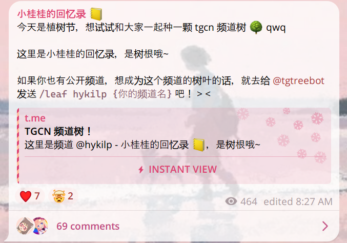
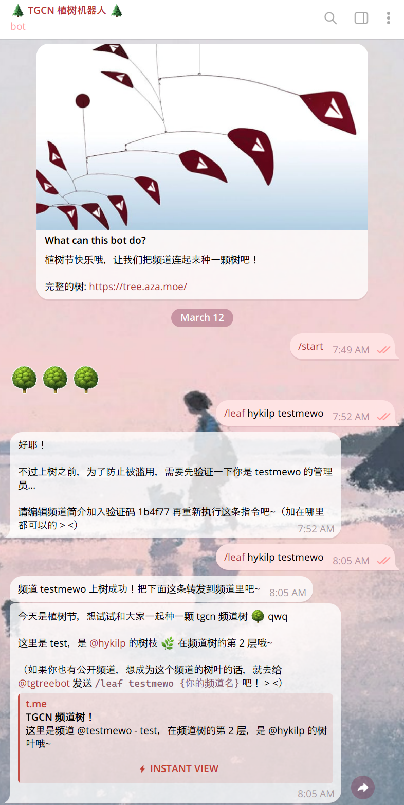

# TGCN 频道树

这是 2025 年植树节的时候在 telegram 上和大家一起种下的频道树 qwq

活动结束的时候树上有 214 个频道，其中有 74 根树枝和 140 个树叶。树上大小频道都有，最大的频道有 83,385 订阅量哇。开坑的时完全没有想到会有这样的影响力，感谢大家参与哦~

可以在 https://tree.aza.moe 查看最终的完整频道树，或者从[树根](https://tree.aza.moe/c/hykilp)开始跟随树杈🔗探索频道树。

这个仓库里是「🌲TGCN 植树机器人🌲」和网页服务器的源码，以及频道树的数据备份。

## 颁奖（？）

下面是一些在可能有意思的极值上的频道 qwq  
（因为包含自己的树根频道有些作弊，下面是除了树根以外的频道哦）

**最高的树叶**: [@PaffWarehouse](https://t.me/PaffWarehouse)  
离树根的距离为 10 个频道

**树叶最多的树枝**: [@XLDFDZ](https://t.me/XLDFDZ)  
有 17 个分叉（3 个树枝和 14 个树叶）

**树枝最多的树枝**: [@Billchenla](https://t.me/Billchenla)  
有 5 个分叉（全都是树枝）

**订阅量最多**: [@pixiv_top50](https://t.me/pixiv_top50)  
有 83,385 位订阅者

**频道@名最长**: [@TooLongloonglooongloooonglooooon](https://t.me/TooLongloonglooongloooonglooooon)  
@名有 32 个字符

**自挂东南枝**: [@lovemachine520](https://t.me/lovemachine520) 和 [@MG08ACA16TE](https://t.me/MG08ACA16TE)  
学会了用奇妙改名漏洞让自己爬上树的人类

**上树频道最多的频道主**: [@clanstnya](https://t.me/clanstnya)  
给频道树添加了 6 个频道

**名字听起来最好吃的频道（R1 钦定）**: [@chheese_cookie_bedrock](https://t.me/chheese_cookie_bedrock)  
「奶酪基岩饼干」

~~**名字听起来最圆圆的让人想 ruarua 的频道**: [@catttballl](https://t.me/catttballl)~~  
「Rua\~rua\~猫猫球」🐈

## 玩法回顾

记录一下玩法啦。在之前活动还在进行的时候，一切都从我的树根频道的这条消息开始：

看到消息的频道主可以找植树机器人输入 `/leaf {@上级树枝} {@频道名}` 来把自己的频道挂到这根树枝上成为树叶。

第一次输入这个指令的时候机器人需要验证频道的管理权，会发送一个验证码让频道主写进频道的简介里，通过了频道就成为树枝啦。

接下来机器人会给频道主发一个类似上面那条消息的消息，频道主可以把这条消息转发到自己的频道里，让频道树被更多人看到~

Bot 完整指令的截图

## 统计分析

感谢 Ciel 做的一些中心性和影响力的分析，感兴趣可以去这里读读: https://t.me/var_log_ciel/831

（之后还会有更多分析的内容会放在这里 qwq）

